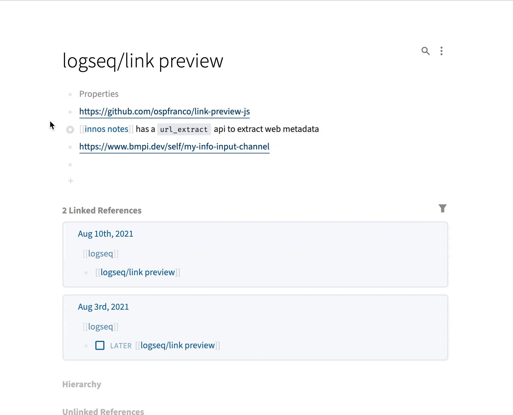

# Logseq Plugin Link Preview

A simple plugin to show basic link information on hovering external links in Logseq.

## Disclaimer 🚨

- This plugin WILL send network requests to the author's server https://pengx17.vercel.app/. If you feel insecure about it, please do not use it.
- The link preview does not always work. e.g., internal links inside of your private network.

## Demo

## TODO

- [ ] An toggle to let the user change the link to link card in the document.
